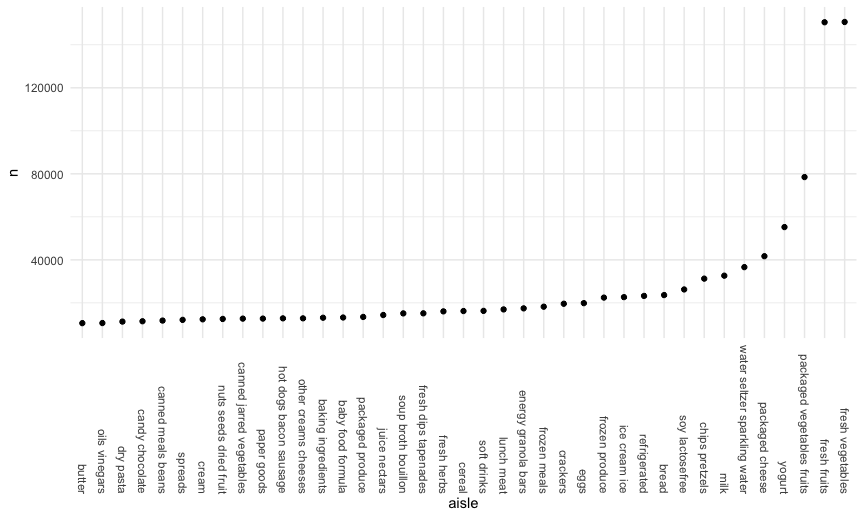
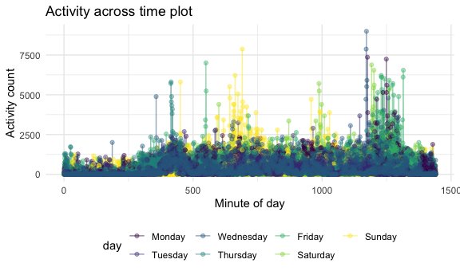

Homework 3 solutions
================
Rio Yan
2020-10-08

## Problem 1

``` r
data("instacart")
```

This dataset contains 1384617 rows and 15 columns.

Observations are the level of items in orders by user. There are user /
order variables – user ID, order ID, order day, and order hour. There
are also item variables – name, aisle, department, and some numeric
codes.

How many aisles, and which are most items from?

``` r
instacart %>% 
  count(aisle) %>% 
  arrange(desc(n))
```

    ## # A tibble: 134 x 2
    ##    aisle                              n
    ##    <chr>                          <int>
    ##  1 fresh vegetables              150609
    ##  2 fresh fruits                  150473
    ##  3 packaged vegetables fruits     78493
    ##  4 yogurt                         55240
    ##  5 packaged cheese                41699
    ##  6 water seltzer sparkling water  36617
    ##  7 milk                           32644
    ##  8 chips pretzels                 31269
    ##  9 soy lactosefree                26240
    ## 10 bread                          23635
    ## # … with 124 more rows

Let’s make a plot

``` r
instacart %>% 
  count(aisle) %>% 
  filter(n > 10000) %>% 
  mutate(
    aisle = factor(aisle),
    aisle = fct_reorder(aisle, n)
  ) %>% 
  ggplot(aes(x = aisle, y = n)) +
  geom_point() +
  theme(axis.text.x = element_text(angle = 270, vjust = 0.5, hjust = 1))
```



Let’s make a table\!

``` r
instacart %>% 
  filter(aisle %in% c("baking ingredients", "dog food care", "packaged vegetables fruits")) %>% 
  group_by(aisle) %>% 
  count(product_name) %>% 
  mutate(rank = min_rank(desc(n))) %>% 
  filter(rank < 4) %>% 
  arrange(aisle, rank) %>% 
  knitr::kable()
```

| aisle                      | product\_name                                 |    n | rank |
| :------------------------- | :-------------------------------------------- | ---: | ---: |
| baking ingredients         | Light Brown Sugar                             |  499 |    1 |
| baking ingredients         | Pure Baking Soda                              |  387 |    2 |
| baking ingredients         | Cane Sugar                                    |  336 |    3 |
| dog food care              | Snack Sticks Chicken & Rice Recipe Dog Treats |   30 |    1 |
| dog food care              | Organix Chicken & Brown Rice Recipe           |   28 |    2 |
| dog food care              | Small Dog Biscuits                            |   26 |    3 |
| packaged vegetables fruits | Organic Baby Spinach                          | 9784 |    1 |
| packaged vegetables fruits | Organic Raspberries                           | 5546 |    2 |
| packaged vegetables fruits | Organic Blueberries                           | 4966 |    3 |

Apples vs ice cream…

``` r
instacart %>% 
  filter(product_name %in% c("Pink Lady Apples", "Coffee Ice Cream")) %>% 
  group_by(product_name, order_dow) %>% 
  summarize(mean_hour = mean(order_hour_of_day)) %>% 
  pivot_wider(
    names_from = order_dow,
    values_from = mean_hour
  )
```

    ## `summarise()` regrouping output by 'product_name' (override with `.groups` argument)

    ## # A tibble: 2 x 8
    ## # Groups:   product_name [2]
    ##   product_name       `0`   `1`   `2`   `3`   `4`   `5`   `6`
    ##   <chr>            <dbl> <dbl> <dbl> <dbl> <dbl> <dbl> <dbl>
    ## 1 Coffee Ice Cream  13.8  14.3  15.4  15.3  15.2  12.3  13.8
    ## 2 Pink Lady Apples  13.4  11.4  11.7  14.2  11.6  12.8  11.9

## Problem 2

Load and tidy data. final dataset should include all originally observed
variables and values; have useful variable names; include a weekday vs
weekend variable; and encode data with reasonable variable classes.
Describe the resulting dataset (e.g. what variables exist, how many
observations, etc).

``` r
accel_df = 
  read_csv(
    "./data/accel_data.csv") %>% 
  janitor::clean_names() %>% 
  pivot_longer(
    activity_1:activity_1440,
    names_to = "minute_of_day",
    names_prefix = "activity_",
    values_to = "activity_count"
    ) %>% 
  mutate(
    day = factor(day, levels = c("Monday", "Tuesday", "Wednesday", "Thursday", "Friday", "Saturday", "Sunday"))
  ) %>% 
  mutate(
    weekday_vs_weekend = 
      case_when(
        day %in% c("Monday", "Tuesday", "Wednesday", "Thursday", "Friday") ~ "weekday",
        day %in% c("Saturday", "Sunday") ~ "weekend")
    ) %>% 
  mutate(
    week = factor(week),
    weekday_vs_weekend = factor(weekday_vs_weekend),
    day_id = factor(day_id),
    day = factor(day),
    day = fct_relevel(day, c("Monday", "Tuesday", "Wednesday", "Thursday", "Friday","Saturday", "Sunday")),
    minute_of_day = as.numeric(minute_of_day)
    ) %>% 
  relocate(day_id, week, day, weekday_vs_weekend)
```

    ## Parsed with column specification:
    ## cols(
    ##   .default = col_double(),
    ##   day = col_character()
    ## )

    ## See spec(...) for full column specifications.

``` r
str(accel_df)
```

    ## tibble [50,400 × 6] (S3: tbl_df/tbl/data.frame)
    ##  $ day_id            : Factor w/ 35 levels "1","2","3","4",..: 1 1 1 1 1 1 1 1 1 1 ...
    ##  $ week              : Factor w/ 5 levels "1","2","3","4",..: 1 1 1 1 1 1 1 1 1 1 ...
    ##  $ day               : Factor w/ 7 levels "Monday","Tuesday",..: 5 5 5 5 5 5 5 5 5 5 ...
    ##  $ weekday_vs_weekend: Factor w/ 2 levels "weekday","weekend": 1 1 1 1 1 1 1 1 1 1 ...
    ##  $ minute_of_day     : num [1:50400] 1 2 3 4 5 6 7 8 9 10 ...
    ##  $ activity_count    : num [1:50400] 88.4 82.2 64.4 70 75 ...

descriptio:::::

Traditional analyses of accelerometer data focus on the total activity
over the day. Using your tidied dataset, aggregate accross minutes to
create a total activity variable for each day, and create a table
showing these totals. Are any trends apparent?

``` r
accel_df %>% 
  group_by(week, day) %>% 
  summarize(total_activity = sum(activity_count)) %>% 
  pivot_wider(
    names_from = day,
    values_from = total_activity
  )
```

    ## `summarise()` regrouping output by 'week' (override with `.groups` argument)

    ## # A tibble: 5 x 8
    ## # Groups:   week [5]
    ##   week   Monday Tuesday Wednesday Thursday  Friday Saturday Sunday
    ##   <fct>   <dbl>   <dbl>     <dbl>    <dbl>   <dbl>    <dbl>  <dbl>
    ## 1 1      78828. 307094.   340115.  355924. 480543.   376254 631105
    ## 2 2     295431  423245    440962   474048  568839    607175 422018
    ## 3 3     685910  381507    468869   371230  467420    382928 467052
    ## 4 4     409450  319568    434460   340291  154049      1440 260617
    ## 5 5     389080  367824    445366   549658  620860      1440 138421

``` r
# We can see from the table that usually the participant has an average activity count around 400000. The participant's Tuesday to Thursday's activity count has a smaller variance compares to Monday, Saturday and Sunday. The first day of the first week has the least amount of activity count for that week. Week four and five's weekend have the least amount of activity. Saturdays in general have the least sum of activity count. 
```

Accelerometer data allows the inspection activity over the course of the
day. Make a single-panel plot that shows the 24-hour activity time
courses for each day and use color to indicate day of the week. Describe
in words any patterns or conclusions you can make based on this graph.

``` r
accel_df %>% 
  ggplot(aes(x = minute_of_day, y = activity_count, color = day)) +
  geom_point(alpha = .5) +
  geom_smooth()
```

    ## `geom_smooth()` using method = 'gam' and formula 'y ~ s(x, bs = "cs")'



## Problem 3

The goal is to do some exploration of this dataset. To that end, write a
short description of the dataset, noting the size and structure of the
data, describing some key variables, and indicating the extent to which
missing data is an issue. Then, do or answer the following (commenting
on the results of each):

Load data

``` r
data("ny_noaa")
```

The dataset contains data from New York state weather stations. This
dataset contains 2595176 rows and 7 columns.

There are seven important variables in the dataset, weather station ID,
date of observation, precipitation (tenths of mm), snowfall (mm), snow
depth (mm), maximum and minimum temperature (tenths of degrees C). Each
weather station may collect only a subset of these variables, and
therefore the resulting dataset contains extensive missing data.

Do some data cleaning. Ensure observations for temperature,
precipitation, and snowfall are given in reasonable units. For snowfall,
what are the most commonly observed values? Why?

``` r
ny_noaa_df = 
  ny_noaa %>% 
  separate(date, into = c("year", "month", "day")) %>%
  mutate(
    tmax = as.numeric(tmax),
    tmin = as.numeric(tmin),
  ) %>% 
  mutate(
    prcp = prcp / 10,
    tmax = tmax / 10,
    tmin = tmin / 10
  )
```
