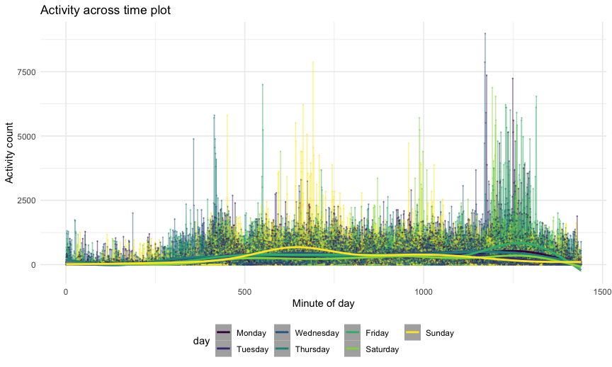
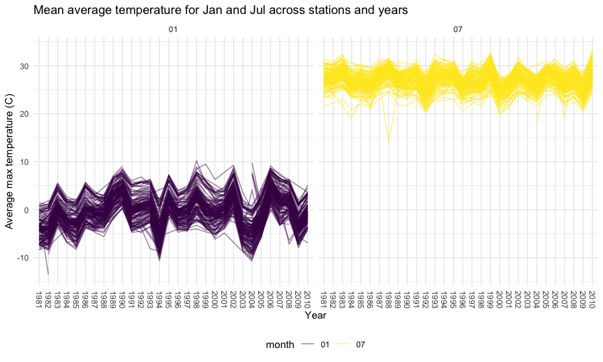
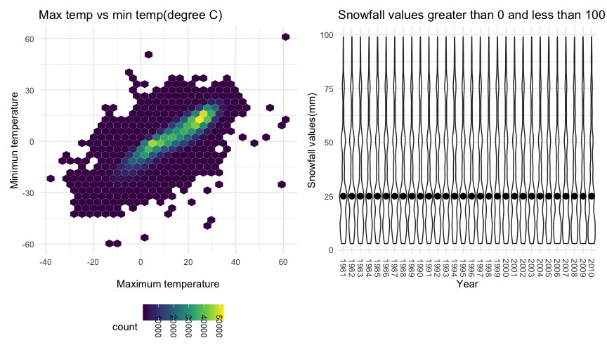

Homework 3 solutions
================
Rio Yan
2020-10-10

## Problem 1

``` r
data("instacart")
```

This dataset contains 1384617 rows and 15 columns.

Observations are the level of items in orders by user. There are user /
order variables – user ID, order ID, order day, and order hour. There
are also item variables – name, aisle, department, and some numeric
codes.

How many aisles, and which are most items from?

``` r
instacart %>% 
  count(aisle) %>% 
  arrange(desc(n))
```

    ## # A tibble: 134 x 2
    ##    aisle                              n
    ##    <chr>                          <int>
    ##  1 fresh vegetables              150609
    ##  2 fresh fruits                  150473
    ##  3 packaged vegetables fruits     78493
    ##  4 yogurt                         55240
    ##  5 packaged cheese                41699
    ##  6 water seltzer sparkling water  36617
    ##  7 milk                           32644
    ##  8 chips pretzels                 31269
    ##  9 soy lactosefree                26240
    ## 10 bread                          23635
    ## # … with 124 more rows

Let’s make a plot

``` r
instacart %>% 
  count(aisle) %>% 
  filter(n > 10000) %>% 
  mutate(
    aisle = factor(aisle),
    aisle = fct_reorder(aisle, n)
  ) %>% 
  ggplot(aes(x = aisle, y = n)) +
  geom_point() +
  theme(axis.text.x = element_text(angle = 270, vjust = 0.5, hjust = 1))
```


Let’s make a table\!

``` r
instacart %>% 
  filter(aisle %in% c("baking ingredients", "dog food care", "packaged vegetables fruits")) %>% 
  group_by(aisle) %>% 
  count(product_name) %>% 
  mutate(rank = min_rank(desc(n))) %>% 
  filter(rank < 4) %>% 
  arrange(aisle, rank) %>% 
  knitr::kable()
```

| aisle                      | product\_name                                 |    n | rank |
| :------------------------- | :-------------------------------------------- | ---: | ---: |
| baking ingredients         | Light Brown Sugar                             |  499 |    1 |
| baking ingredients         | Pure Baking Soda                              |  387 |    2 |
| baking ingredients         | Cane Sugar                                    |  336 |    3 |
| dog food care              | Snack Sticks Chicken & Rice Recipe Dog Treats |   30 |    1 |
| dog food care              | Organix Chicken & Brown Rice Recipe           |   28 |    2 |
| dog food care              | Small Dog Biscuits                            |   26 |    3 |
| packaged vegetables fruits | Organic Baby Spinach                          | 9784 |    1 |
| packaged vegetables fruits | Organic Raspberries                           | 5546 |    2 |
| packaged vegetables fruits | Organic Blueberries                           | 4966 |    3 |

Apples vs ice cream…

``` r
instacart %>% 
  filter(product_name %in% c("Pink Lady Apples", "Coffee Ice Cream")) %>% 
  group_by(product_name, order_dow) %>% 
  summarize(mean_hour = mean(order_hour_of_day)) %>% 
  pivot_wider(
    names_from = order_dow,
    values_from = mean_hour
  )
```

    ## `summarise()` regrouping output by 'product_name' (override with `.groups` argument)

    ## # A tibble: 2 x 8
    ## # Groups:   product_name [2]
    ##   product_name       `0`   `1`   `2`   `3`   `4`   `5`   `6`
    ##   <chr>            <dbl> <dbl> <dbl> <dbl> <dbl> <dbl> <dbl>
    ## 1 Coffee Ice Cream  13.8  14.3  15.4  15.3  15.2  12.3  13.8
    ## 2 Pink Lady Apples  13.4  11.4  11.7  14.2  11.6  12.8  11.9

## Problem 2

Load and tidy data.

``` r
accel_df = 
  read_csv(
    "./data/accel_data.csv") %>% 
  janitor::clean_names() %>% 
  pivot_longer(
    activity_1:activity_1440,
    names_to = "minute_of_day",
    names_prefix = "activity_",
    values_to = "activity_count"
    ) %>% 
  mutate(
    day = factor(day, levels = c("Monday", "Tuesday", "Wednesday", "Thursday", "Friday", "Saturday", "Sunday"))
  ) %>% 
  mutate(
    weekday_vs_weekend = 
      case_when(
        day %in% c("Monday", "Tuesday", "Wednesday", "Thursday", "Friday") ~ "weekday",
        day %in% c("Saturday", "Sunday") ~ "weekend")
    ) %>% 
  mutate(
    week = factor(week),
    weekday_vs_weekend = factor(weekday_vs_weekend),
    day_id = factor(day_id),
    day = factor(day),
    day = fct_relevel(day, c("Monday", "Tuesday", "Wednesday", "Thursday", "Friday","Saturday", "Sunday")),
    minute_of_day = as.numeric(minute_of_day)
    ) %>% 
  relocate(day_id, week, day, weekday_vs_weekend)
```

    ## Parsed with column specification:
    ## cols(
    ##   .default = col_double(),
    ##   day = col_character()
    ## )

    ## See spec(...) for full column specifications.

Description of new dataset:

The dataset contains five weeks of accelerometer data collected on a 63
year-old male with BMI 25. This dataset contains 50400 rows and 6
columns, so there are 50400 observations in total. “Day\_id”, “week”,
and “day” variables are day variables used to document and identify
different study days. The new variable “weekday\_vs\_weekend” separates
the study days into two categories, weekdays and weekends. The
“minute\_of\_day” and “activity\_count” store data from the original
dataset activity\_1 to activity\_1440. “Minute\_of\_day” collects minute
data for each day starting from the 1st minute to the last 1440th
minute, and “activity\_count” calculates how active the participant was
during each minute.

Aggregate across minutes to create a total activity variable for each
day, and create a table showing these totals.

``` r
accel_df %>% 
  group_by(week, day) %>% 
  summarize(total_activity = sum(activity_count)) %>% 
  pivot_wider(
    names_from = day,
    values_from = total_activity
  ) %>% 
  knitr::kable(digits = 1)
```

    ## `summarise()` regrouping output by 'week' (override with `.groups` argument)

| week |   Monday |  Tuesday | Wednesday | Thursday |   Friday | Saturday | Sunday |
| :--- | -------: | -------: | --------: | -------: | -------: | -------: | -----: |
| 1    |  78828.1 | 307094.2 |    340115 | 355923.6 | 480542.6 |   376254 | 631105 |
| 2    | 295431.0 | 423245.0 |    440962 | 474048.0 | 568839.0 |   607175 | 422018 |
| 3    | 685910.0 | 381507.0 |    468869 | 371230.0 | 467420.0 |   382928 | 467052 |
| 4    | 409450.0 | 319568.0 |    434460 | 340291.0 | 154049.0 |     1440 | 260617 |
| 5    | 389080.0 | 367824.0 |    445366 | 549658.0 | 620860.0 |     1440 | 138421 |

Description on trends:

We can see from the table that most of the activity count is around
400000, but there is no prominent trends in general. The participant’s
Tuesday to Thursday’s activity count has a smaller variance compares to
Monday, Saturday and Sunday. Saturdays have the largest variation in
activity count, ranging from 1440 to 607175. Saturdays on week four and
five have the least amount of activity count. It’s also interesting to
note that if the participants have an aggregated activity count over
600000, he will definitely not be as active the next day.

Make a single-panel plot that shows the 24-hour activity time courses
for each day and use color to indicate day of the week.

``` r
accel_df %>% 
  ggplot(aes(x = minute_of_day, y = activity_count, color = day)) +
  geom_line(alpha = 0.5) +
  geom_point(alpha = 0.3, size = 0.2) +
  geom_smooth(alpha = 0.8) +
  labs(title = "Activity across time plot",
       x = "Minute of day",
       y = "Activity count")
```

    ## `geom_smooth()` using method = 'gam' and formula 'y ~ s(x, bs = "cs")'



Description of the graph:

From the graph, we can see that the participant usually wakes up at
around 7 am(420th min) and goes to bed at around 9:30pm(1300th min).
There are a couple of clusters of high activity count around 10 am(600th
min), 4:30pm(1000th min), and around 9pm(1250th min). The clusters are
more apparent when I added the geom\_smooth line, especially around 10am
and 9pm. 10 am cluster usually happens on Sundays, 4:30pm one usually
happens on Saturday and Sunday, and 9pm one usually happens on Tuesdays,
Wednesdays, Fridays and Saturdays. These may indicate that the
participant is more active during the nights across all days, but tries
to be more active in the morning or the afternoon during the weekends.

## Problem 3

Load data

``` r
data("ny_noaa")
```

Description of dataset: The dataset contains data from New York state
weather stations. This dataset contains 2595176 rows and 7 columns.

There are seven important variables in the dataset: id identifies
weather station ID, date keeps track of the date of observation, prcp
records precipitation (tenths of mm), snow records snowfall (mm), snwd
records snow depth (mm), tmax and tmin record maximum and minimum
temperature (tenths of degrees C). Each weather station may collect only
a subset of these variables, and therefore the resulting dataset
contains extensive missing data.

Data cleaning to ensure observations for temperature, precipitation, and
snowfall are given in reasonable units.

``` r
ny_noaa_df = 
  ny_noaa %>% 
  separate(date, into = c("year", "month", "day")) %>%
  mutate(
    tmax = as.numeric(tmax),
    tmin = as.numeric(tmin),
  ) %>% 
  mutate(
    prcp = prcp / 10,
    tmax = tmax / 10,
    tmin = tmin / 10
  )

ny_noaa_df %>% 
  count(snow) %>% 
  arrange(desc(n))
```

    ## # A tibble: 282 x 2
    ##     snow       n
    ##    <int>   <int>
    ##  1     0 2008508
    ##  2    NA  381221
    ##  3    25   31022
    ##  4    13   23095
    ##  5    51   18274
    ##  6    76   10173
    ##  7     8    9962
    ##  8     5    9748
    ##  9    38    9197
    ## 10     3    8790
    ## # … with 272 more rows

In this data chunk, I created a new dataframe to store the ny\_noaa data
and separate the date variable into three individual year, month and day
variables. then I changed the tmax and tmin variable class to numeric
and gave prcp, tamx and tmin reasonable units by divided them by 10. 0
is the most commonly observed values in snowfall. The reason might be
that NY state usually snows during the winter from December to February,
so there is a long period of time that NY has 0 snowfall throughout the
years.

Make a two-panel plot showing the average max temperature in January and
in July in each station across years.

``` r
ny_noaa_df %>% 
  group_by(id, year, month) %>%
  filter(month %in% c("01", "07")) %>%
  summarize(mean_tmax = mean(tmax, na.rm = TRUE)) %>% 
  ggplot(aes(x = year, y = mean_tmax, group = id, color = month)) +
  geom_line(alpha = .5) +
  facet_grid(. ~ month) +
  theme(axis.text.x = element_text(angle = 270, vjust = 0.5, hjust = 1)) +
  labs(title = "Mean average temperature for Jan and Jul across stations and years",
       x = "Year",
       y = "Average max temperature (C)")
```

    ## `summarise()` regrouping output by 'id', 'year' (override with `.groups` argument)

    ## Warning: Removed 5640 row(s) containing missing values (geom_path).



Description:

From the plot, the maximum temperature in July (around 20 C - 30 C)is
much higher than the maximum temperature in January (around -10 C to 10
C). There is also a slight increase in the average maximum temperature
in both January and July plot comparing 1981 and 2010. This increase may
be an indication of global warming. Also the variation of maximum
temperature in January across the years are pretty high. There are
several outliers in the January plot. 1982, 1994, and 2004 show much
lower average maximum temperature compare to the other years. 1998, 2005
and 2006 show much higher average maximum temperature compare to the
other years. For the July plot, the variance among the temperatures are
lower, also with several outliers. 1984, 1988 and 2004 show much lower
average maximum temperature compare to the other years with 1988 being
the lowest at 14 C. 1993 and 2010 show higher average maximum
temperature.

Make a two-panel plot showing (i) tmax vs tmin for the full dataset

``` r
#(i) plot
tmax_tmin_p = 
  ny_noaa_df %>% 
  ggplot(aes(x = tmax, y = tmin)) +
  geom_hex() +
  theme(legend.text = element_text(angle = 270, vjust = 0.5, hjust = 1)) +
  labs(title = "Max temp vs min temp(degree C)",
       x = "Maximum temperature",
       y = "Minimun temperature")
```

From the plot, we can see that most of the tmax and tmin intersect at
around 0\~40C in maximum temperature and -10\~25 C in minimum
temperature. Tmax at 23 C and tmin at 25 C have the most count. There
are some outliers, with tmax at 60C and tmin at 60C being the most
extreme one.

2)  make a plot showing the distribution of snowfall values greater than
    0 and less than 100 separately by year.

<!-- end list -->

``` r
#(ii) plot
snowfall_p = 
  ny_noaa_df %>% 
  filter(snow > 0 & snow < 100) %>% 
  ggplot(aes( x = as.factor(year), y = snow)) +
  geom_violin() +
  stat_summary(fun = "median") +
  theme(axis.text.x = element_text(angle = 270, vjust = 0.5, hjust = 1)) +
  labs(title = "Snowfall values greater than 0 and less than 100 by year ",
       x = "Year",
       y = "Snowfall values(mm)")
```

From the snowfall values plot, the snallfall values in general have
similar distribution across 1981 to 2010 and most of the snowfall values
are mainly between 0\~25mm, with some smaller clusters in 50mm and 75mm,
all with a median at 25mm.

two-panel plot combining the two

``` r
library(patchwork)
tmax_tmin_p + snowfall_p
```

    ## Warning: Removed 1136276 rows containing non-finite values (stat_binhex).

    ## Warning: Removed 30 rows containing missing values (geom_segment).


